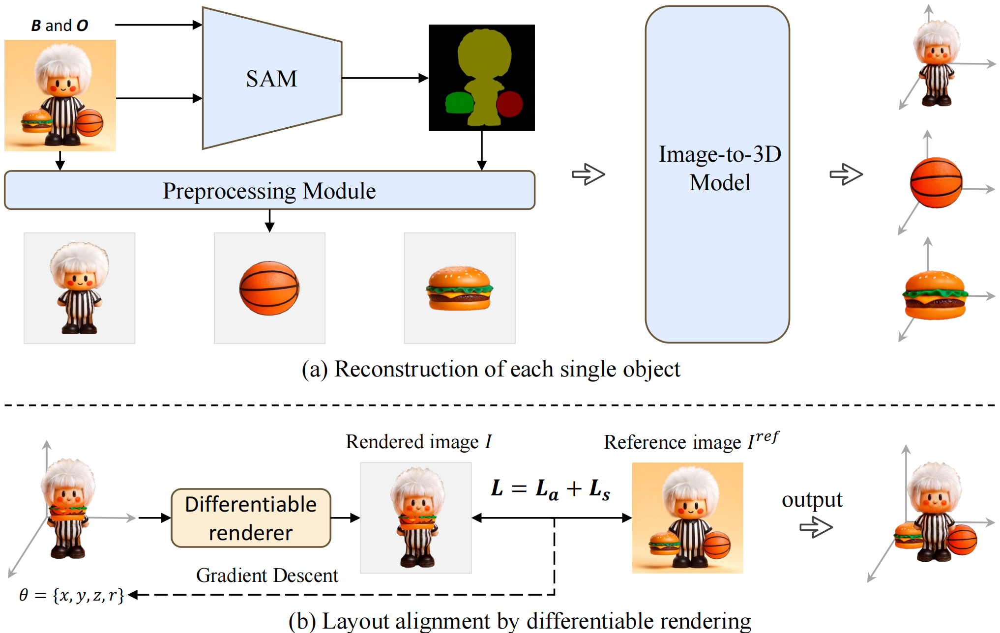

<p align="center">

  <h2 align="center">REPARO: Compositional 3D Assets Generation with Differentiable 3D Layout Alignment </h2>
  <p align="center">
    <strong>Haonan Han</strong></a><sup>1*</sup>
    · 
    <strong>Rui Yang</strong></a><sup>2*</sup>
    · 
    <strong>Huan Liao</strong></a><sup>1*</sup>
    ·
    <strong>Jiankai Xing</strong></a><sup>1</sup>
    ·
    <strong>Zunnan Xu</strong></a><sup>1</sup>
    ·
    <br>
    <strong>Xiaoming Yu</strong></a><sup>3</sup>
    ·
    <strong>Junwei Zha</strong></a><sup>3</sup>
    ·
    <strong>Xiu Li</strong></a><sup>1†</sup>
    ·
    <strong>Wanhua Li</strong></a><sup>4†</sup>
    ·
    <br>
    <sup>1</sup>Tsinghua University  &nbsp;&nbsp;&nbsp; <sup>2</sup>The University of Hong Kong &nbsp;&nbsp;&nbsp;
    <br>
    <sup>3</sup>Tencent Meeting &nbsp;&nbsp;&nbsp; <sup>4</sup>Harvard University
    <br>
    </br>
        <a href="https://arxiv.org/pdf/2405.18525"></a> &nbsp; &nbsp;  &nbsp;
<a href="https://reparo2024.github.io/"></a>&nbsp; &nbsp;  &nbsp;
<a href="https://cloud.tsinghua.edu.cn/f/f26dbb5ba50d4e12b5d9/?dl=1"></a>&nbsp; &nbsp;  &nbsp;
<a href="https://cloud.tsinghua.edu.cn/f/75385ce44766451fba89/?dl=1"></a>
    </br>
    REPARO is a novel approach for compositional 3D asset generation from
    single images. It employs a two-step process: first, it extracts individual
    objects from the scene and reconstructs their 3D meshes using off-the-shelf imageto-3D models; then, it optimizes the layout of these meshes through differentiable
    rendering techniques, ensuring coherent scene composition. By integrating optimal
    transport-based long-range appearance loss term and high-level semantic loss term
    in the differentiable rendering, REPARO can effectively recover the layout of 3D
    assets. The proposed method can significantly enhance object independence, detail
    accuracy, and overall scene coherence. 


  </p>
    </p>
<!-- <div align="center"> -->

🧙‍♀️ The name is inspired by [repairing charm](https://harrypotter.fandom.com/zh/wiki/%E4%BF%AE%E5%A4%8D%E5%92%92?variant=zh) in Harry Potter.

## Todo List
- [x] 🪄 Release on arxiv!
- [x] 🪄 Release demo page!
- [x] 🪄 Release test dataset GSO 20 selected from [Google Scanned Objects](https://app.gazebosim.org/GoogleResearch/fuel/collections/Scanned%20Objects%20by%20Google%20Research)!
- [x] 🔥 Release [synthetic single assets](https://cloud.tsinghua.edu.cn/f/75385ce44766451fba89/?dl=1) generated by DreamGaussian and TripoSR.
- [x] 🔥 Release differentiable layout alignment code based on 6D-RGBDXY inverse rendering.
- [x] 🔥 Release metrics evaluation scripts in the light of multi-view of assets.
- [ ] 🦄 Release more qualitative experimental results.

## Installation
Create a new conda environment and install the required packages:
```
conda create -n REPARO python=3.8
conda activate REPARO

#Install PyTorch
conda install pytorch==1.11.0 torchvision==0.12.0 torchaudio==0.11.0 cudatoolkit=11.3 -c pytorch

#Install geomloss 
pip install pykeops
pip install geomloss

#Install customized PyTorch3D
conda install -c fvcore -c iopath -c conda-forge fvcore iopath
conda install -c bottler nvidiacub
git clone https://github.com/jkxing/pytorch3d
cd pytorch3d
python setup.py install

#Install Nvdiffrast
git clone https://github.com/NVlabs/nvdiffrast
cd nvdiffrast
pip install .

#Install other tools
conda install -c pytorch ignite 
pip install tensorboard matplotlib xmltodict pyglm imageio lpips opencv-python
```

## Data
You can download the ground truth dataset selected from GSO and the synthetic dataset generated by DreamGaussian and TripoSR as a packaged zip file directly from [here](https://cloud.tsinghua.edu.cn/f/75385ce44766451fba89/?dl=1). 

After downloading, you should extract it to `data/`. Folders should include
```
data/
├── furniture/
├── furniture_triposr/
├── GSO_gt/
└── GSO_gt_mod/
```

## Train
### Runing on multi-gpu
```
bash scripts/auto_run.sh
```
### Runing on single-gpu
```
python experiments/furniture/optim_reparo.py --config $CONFIG
```
* `config`: saving all the parameters. A sample can be find in the `config/dreamgaussian/furniture_rgbxy_wo_proxy.json`
The meaning of the config:
```
{
    "task_name"         :   "furniture_rgbxy_3",
    "data_dir"          :   "data/furniture", ### the folder saving all data (this is generated by 3D generative models)
    "data_info_file"    :   "data/furniture/meta_info.json", ### the file saving all related infomation about each cases.
    "save_dir"          :   "results", ### The folder to save final results.
    "bbox"              :   1.0,
    "resolution"        :   [256,256],
    "simple"            :   true,
    "renderer"          :   {"light_power":0.5,"background":"white","shading":true},
    "setting"           :   {"Niter":500,"optimizer":"Adam","learning_rate":0.02,"view_per_iter":2,"decay":0.999},
    "method"            :   ["our"],
    "laplacian_loss"    :   false,
    "matching"          :   {"matcher":"Sinkhorn","matching_interval":5},
    "debug"             :   true,
    "show"              :   false,
    "view"              :   {
        "type":"perspective",
        "num":1,
        "direction":"manual", 
        "dist":2.0, 
        "fov":49.1,
        "znear":0.1,
        "zfar":100.0,
        "center":[0.0,0.0,0.0],
        "position":[[0.0,0.0,2.0]]
    }
}
```

## Evaluation
We have released evaluation scripts that test the quality of the generated results in multi-view 2D images rendered from generated 3D asset. Adopted metrics includes PSNR, SSIM, LPIPS and CLIP Score.

**Usage**
```
python evaluation/eval_2d.py --config $CONFIG
```

## Acknowledgement
☀️ We are truly indebted to the following outstanding open source work upon which we have based our work: [SAM](https://github.com/facebookresearch/segment-anything), [DreamGaussian](https://github.com/dreamgaussian/dreamgaussian), [Wonder3D](https://github.com/xxlong0/Wonder3D), [OpenLRM](https://github.com/3DTopia/OpenLRM), [DROT](https://github.com/jkxing/DROT), [TripoSR](https://github.com/VAST-AI-Research/TripoSR), [stablediffusion-infinity](https://github.com/lkwq007/stablediffusion-infinity), and [nvdiffrast](https://github.com/NVlabs/nvdiffrast).

## Citation

```
@misc{han2024reparo,
      title={REPARO: Compositional 3D Assets Generation with Differentiable 3D Layout Alignment}, 
      author={Haonan Han and Rui Yang and Huan Liao and Jiankai Xing and Zunnan Xu and Xiaoming Yu and Junwei Zha and Xiu Li and Wanhua Li},
      year={2024},
      eprint={2405.18525},
      archivePrefix={arXiv},
      primaryClass={cs.CV}
}

```
