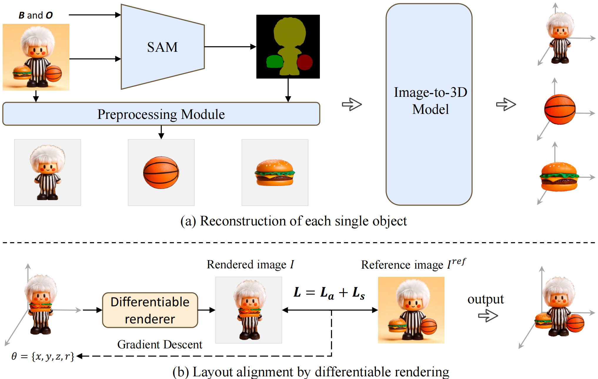

# REPARO: Compositional 3D Assets Generation with Differentiable 3D Layout Alignment

🧙‍♀️ The name is inspired by [repairing charm](https://harrypotter.fandom.com/zh/wiki/%E4%BF%AE%E5%A4%8D%E5%92%92?variant=zh) in Harry Potter.


<a href="https://arxiv.org/pdf/2405.18525"></a> 
<a href="https://reparo2024.github.io/"></a>
<a href="https://cloud.tsinghua.edu.cn/f/f26dbb5ba50d4e12b5d9/?dl=1"></a>

REPARO is a novel approach for compositional 3D asset generation from
single images. It employs a two-step process: first, it extracts individual
objects from the scene and reconstructs their 3D meshes using off-the-shelf imageto-3D models; then, it optimizes the layout of these meshes through differentiable
rendering techniques, ensuring coherent scene composition. By integrating optimal
transport-based long-range appearance loss term and high-level semantic loss term
in the differentiable rendering, REPARO can effectively recover the layout of 3D
assets. The proposed method can significantly enhance object independence, detail
accuracy, and overall scene coherence. 



## Todo List
- [x] 🔥 Release on arxiv!
- [x] 🔥 Release demo page!
- [x] 🔥 Release test dataset GSO 20 selected from [Google Scanned Objects](https://app.gazebosim.org/GoogleResearch/fuel/collections/Scanned%20Objects%20by%20Google%20Research)!
- [ ] Release synthetic single assets generated by DreamGaussian and TripoSR.
- [ ] Release differentiable layout alignment code based on 6D-RGBDXY inverse rendering.
- [ ] Release metrics evaluation scripts in the light of multi-view of assets.
- [ ] Release more qualitative experimental results.


## Acknowledgement
☀️ We are truly indebted to the following outstanding open source work upon which we have based our work: [SAM](https://github.com/facebookresearch/segment-anything), [DreamGaussian](https://github.com/dreamgaussian/dreamgaussian), [Wonder3D](https://github.com/xxlong0/Wonder3D), [OpenLRM](https://github.com/3DTopia/OpenLRM), [DROT](https://github.com/jkxing/DROT), [TripoSR](https://github.com/VAST-AI-Research/TripoSR), [stablediffusion-infinity](https://github.com/lkwq007/stablediffusion-infinity), and [nvdiffrast](https://github.com/NVlabs/nvdiffrast).

## Citation

```
@misc{han2024reparo,
      title={REPARO: Compositional 3D Assets Generation with Differentiable 3D Layout Alignment}, 
      author={Haonan Han and Rui Yang and Huan Liao and Jiankai Xing and Zunnan Xu and Xiaoming Yu and Junwei Zha and Xiu Li and Wanhua Li},
      year={2024},
      eprint={2405.18525},
      archivePrefix={arXiv},
      primaryClass={cs.CV}
}

```
